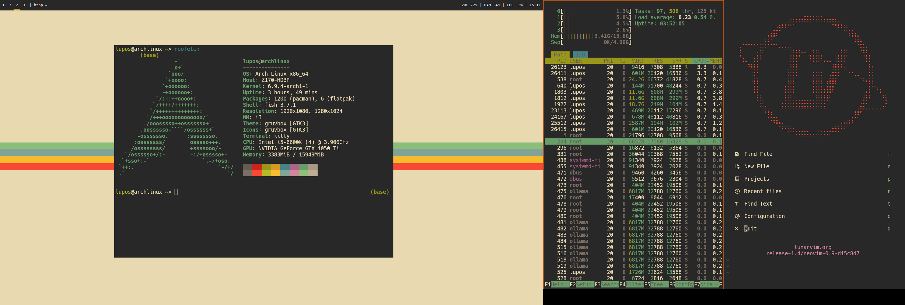

# Dotfiles 

These are the dotfiles they I use on my system, I wouldn't recommend using them, there are better out there.
I am using the following software:
- **Window-Manager:** [i3](https://i3wm.org/)
- **Status-Bar:** [Polybar](https://github.com/polybar/polybar)
- **Terminal:** [Kitty](https://sw.kovidgoyal.net/kitty/)
- **Shell:** [Fish](https://fishshell.com/)
- **Window-Switcher:** [Rofi](https://github.com/davatorium/rofi)
- **Font:** [Hack Nerd Font](https://www.nerdfonts.com/) 

